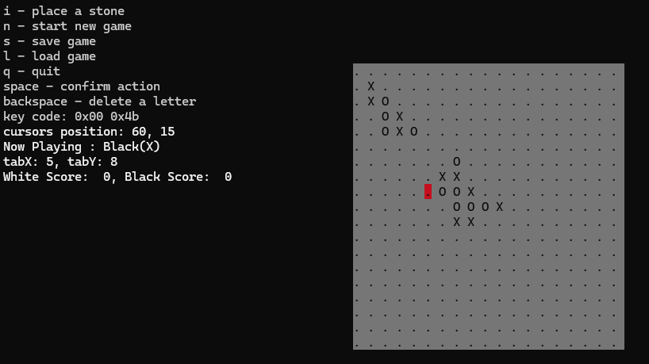

# Go Game Simulator

    

## Description
The Go Game Simulator is a C++ console application that simulates the ancient board game Go. The game includes all essential features such as placing stones, capturing, scoring, and applying the ko rule. The graphical representation is done using ASCII characters in the console. The game supports saving and loading the state to and from a file, allowing players to resume their game at any time.

## Features
- **Board Customization**: Choose from predefined board sizes (19x19, 13x13, 9x9) or enter a custom size.
- **Turn-Based Gameplay**: Players take turns to place stones on the board.
- **Human vs. Human**: The game supports two human players.
- **Special Rules**:
  - **Ko Rule**: Prevents repeating the same board position.
  - **Handicap Option**: Allows weaker players to start with an advantage.
- **Scoring**: Automatically updates and displays the score.
- **Save and Load**: Save the current game state to a file and load it back later to continue playing.
- **Simple Capture**: Implements basic capturing rules of the game.
- **Multiple Capture**: Handles capturing multiple stones using a flood fill algorithm.

## How to Play
1. **Start the Game**: Run the program and choose the board size and handicap option.
2. **Place Stones**: Use keyboard arrows to navigate and the 'i' key to place stones.
3. **Game Commands**:
   - `i`: Place a stone.
   - `n`: Start a new game.
   - `s`: Save the current game.
   - `l`: Load a saved game.
   - `q`: Quit the game.
4. **Navigation**: Use arrow keys to move the cursor around the board.
5. **Confirm Actions**: Use the space bar to confirm certain actions like board size and handicap.

## Classes and Methods

### Core Functions
- `printBoard(vectorV_t board, const int boardsize, int tabX, int tabY)`: Displays the current state of the board.
- `placeStone(int tabX, int tabY, int& playerTurn, vectorV_t board, const int boardsize, int& whiteScore, int& blackScore, PointKo& ko)`: Places a stone on the board.
- `isSurrounded(int tabX, int tabY, int playerTurn, vectorV_t board, const int boardsize)`: Checks if a stone is surrounded.
- `isOccupied(int tabX, int tabY, vectorV_t board, const int boardsize)`: Checks if a field is occupied.
- `simpleCapture(int tabX, int tabY, int playerTurn, vectorV_t board, const int boardsize, int& whiteScore, int& blackScore)`: Captures a single stone.
- `simpleScore(int tabX, int tabY, int playerTurn, vectorV_t board, const int boardsize, int& whiteScore, int& blackScore)`: Grants points after capturing a stone.
- `reset(vectorV_t board, int& boardsize, int& whiteScore, int& blackScore, int& isHandicap, int& playerTurn)`: Resets the game state.
- `findKoPoint(int tabX, int tabY, int playerTurn, vectorV_t board, const int boardsize)`: Identifies the ko point.
- `koRule(int tabX, int tabY, PointKo point, int playerTurn)`: Applies the ko rule.
- `start(int x, int y, int& isHandicap, int& boardsize)`: Starts a new game.
- `handicap(vectorV_t board, const int boardsize, int& playerTurn)`: Sets up handicap stones.

### Advanced Functions
- `floodFill(int tabX, int tabY, int playerTurn, vectorV_t board, const int boardsize, vectorPt_t& visited, int& pomocnicza)`: Implements flood fill algorithm for capturing stones.
- `multipleCapture(int tabX, int tabY, int playerTurn, vectorV_t board, const int boardsize, int& whiteScore, int& blackScore)`: Determines and captures multiple stones.
- `multipleScore(int tabX, int tabY, int playerTurn, vectorV_t board, const int boardsize, int& whiteScore, int& blackScore)`: Scores multiple captured stones.
- `save(int playerTurn, vectorV_t board, const int boardsize, int whiteScore, int blackScore, PointKo ko)`: Saves the game state to a file.
- `load(int& playerTurn, vectorV_t board, int& boardsize, int& whiteScore, int& blackScore, PointKo& ko)`: Loads the game state from a file.

## Getting Started

### Prerequisites
- C++ Compiler
- Console that supports the conio2 library

### Compilation
Compile the source code with a C++ compiler. Make sure to link against the conio2 library.

### Running the Game
Execute the compiled program. Use the keyboard to navigate the menu and play the game.

Enjoy playing Go and mastering the strategies of this ancient and intricate board game!
